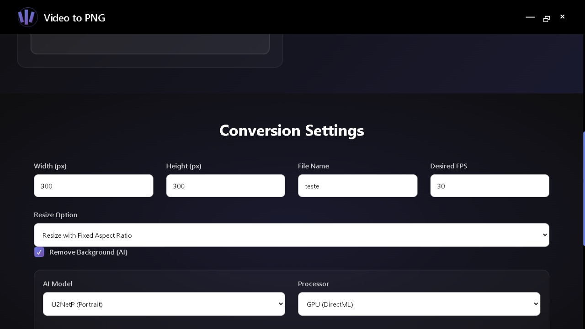

# Video to PNG Converter

[](https://github.com/lefante/video-to-png-JS/releases)
[](https://www.electronjs.org/)
[](LICENSE)

<div align="center">
  
</div>

> A sleek and powerful desktop application to convert videos into high-quality PNG image sequences. Built with Electron and FFmpeg for seamless video processing.

## Features

- **Multiple Video Formats**: Supports MP4, AVI, MKV, and more
- **Flexible Resizing**: Three resizing options:
  - Force resize to specified dimensions
  - Maintain aspect ratio with borders
  - Resize with fixed aspect ratio
- **FPS Control**: Customize frames per second for extraction
- **Cross-Platform**: Works on Windows, macOS, and Linux
- **Fast Processing**: Powered by FFmpeg.wasm for efficient conversion

## Installation

### Option 1: Download Pre-built Executable
1. Visit the [Releases](https://github.com/lefante/video-to-png-JS/releases) page
2. Download the latest `Video to PNG Converter Setup.exe`
3. Run the installer and follow the setup wizard

### Option 2: Build from Source
```bash
# Clone the repository
git clone https://github.com/lefante/video-to-png-JS.git
cd video-to-png-JS

# Install dependencies
npm install

# Start the application
npm start

# Build for your platform
npm run build
```

## Usage

1. **Launch the Application**: Open the Video to PNG Converter app
2. **Select Video**: Choose your input video file
3. **Configure Settings**:
   - Set output directory
   - Choose resizing method
   - Adjust FPS if needed
4. **Convert**: Click the convert button and watch the magic happen!
5. **Access Images**: Find your PNG sequence in the specified output folder

## Technologies

- **[Electron](https://www.electronjs.org/)** - Cross-platform desktop app framework
- **[FFmpeg.wasm](https://ffmpegwasm.netlify.app/)** - WebAssembly port of FFmpeg for browser-based video processing
- **[Node.js](https://nodejs.org/)** - JavaScript runtime for building scalable applications

## Contributing

We welcome contributions! Please feel free to submit a Pull Request.

1. Fork the project
2. Create your feature branch (`git checkout -b feature/AmazingFeature`)
3. Commit your changes (`git commit -m 'Add some AmazingFeature'`)
4. Push to the branch (`git push origin feature/AmazingFeature`)
5. Open a Pull Request

## License

This project is licensed under the MIT License - see the [LICENSE](LICENSE) file for details.

## Author

**lefante** - [GitHub](https://github.com/lefante)

---

<div align="center">
  <p>
    <a href="#video-to-png-converter">Back to top</a>
  </p>
</div>
